# 1. MySQL 安装&配置

### 作者：ShuHang2

# [返回目录](MySQL.MD)

## 安装 MySQL

地址：[MySQL :: Download MySQL Installer](https://dev.mysql.com/downloads/installer/)

安装包大的为离线安装，下载即可 (无需注册，有*No Thanks......*)
**注意！文档未提到的界面一律 Next 或 Execute**

1. 打开 MySQL Community Downloads 下载页面，在 MySQL Installer 8.0.35 窗口中，选择 Microsoft Window 操作系统，可以选择 32 位或 64 位安装包，这里选择 32 位，单击右边 Download 按钮：
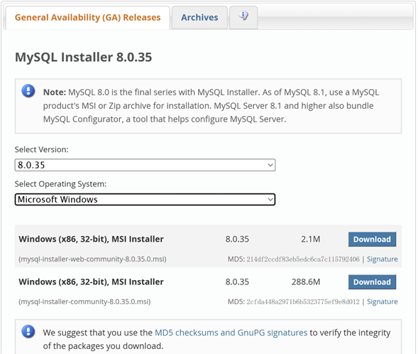
2. 双击下载的 mysql-installer-community-8.0.35.0. Msi 文件，出现“License Agreement”窗口，选中“I accept the license terms”复选框，然后单击“Next”按钮，系统进入“Choosing a Setup Type”窗口，这里选择“Custom”，单击“Next”按钮。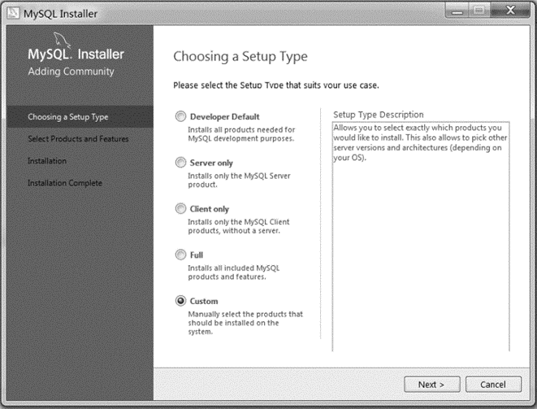
3. 进入“产品定制选择”窗口，这里选择”MySQL Server 8.0.35-x 64”、”MySQL Documentation 8.0.35-x 86”和”MySQL Samples and Examples 8.0.35-x 86”、单击“Next”按钮。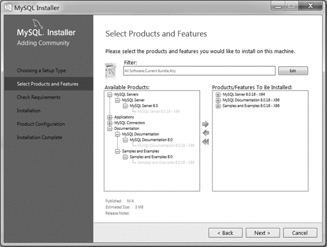
4. 进入“准备安装”窗口，单击“Execute”按钮。
5. 开始安装 MySQL 文件，安装完成后在“Status”列将显示 Complete。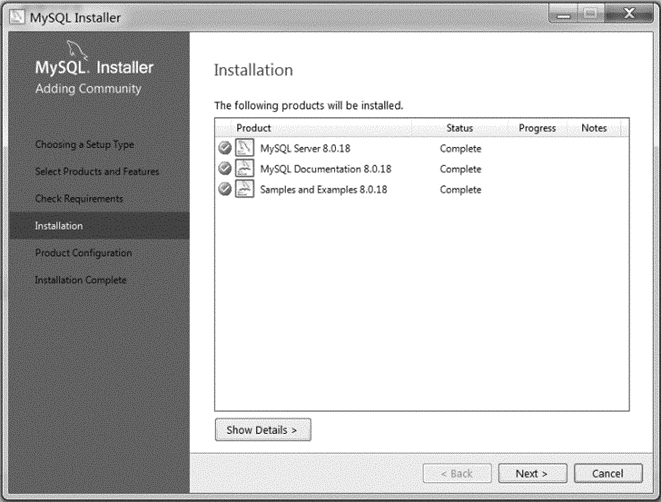

## 配置 MySQL

1. 在 MySQL 安装步骤第 5 步，单击“Next”按钮，进入“产品配置”窗口。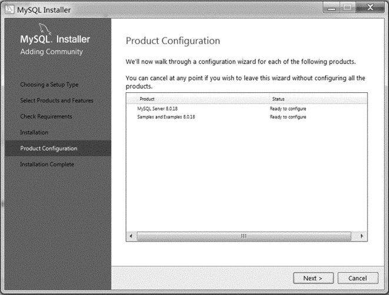
2. 单击“Next”按钮，进入“服务器配置”窗口：
3. 单击“Next”按钮，进入“服务器类型配置”窗口，采用默认设置，其中，“Config Type“下拉文本框有 3 个选项：Development Machine、Server Machine、Dedicated Machine，这里选择 Development Machine 选项。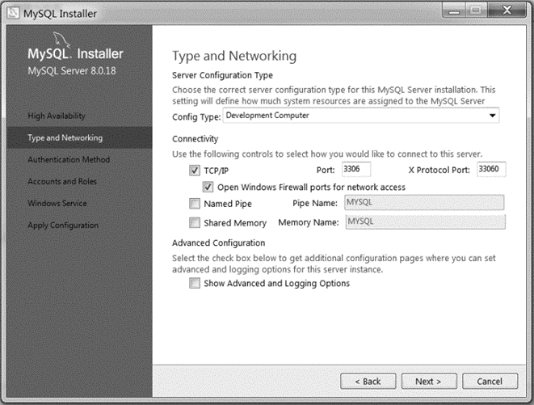
4. 单击“Next”按钮，进入“授权方式”窗口。其中，第 1 个单选项为 MySQL 8.0 提供的新的授权方法，它是基于更强大的 SHA 256 的密码方法；第 2 个单选项为传统的授权方法，保留 5. X 版本的兼容性。这里选择第 2 个单选项。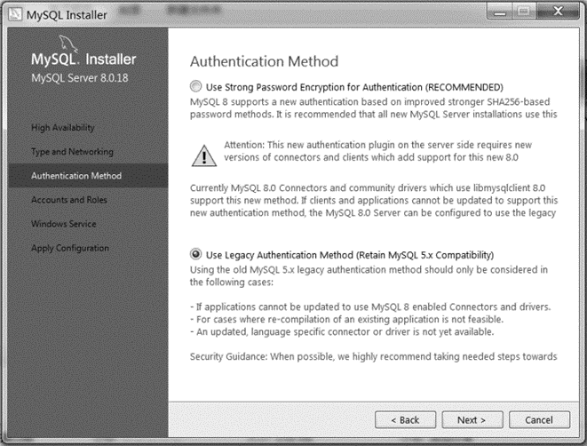
5. 单击“Next”按钮，进入“设置服务器密码”窗口，输入两次同样的密码，这里设置密码为 123456。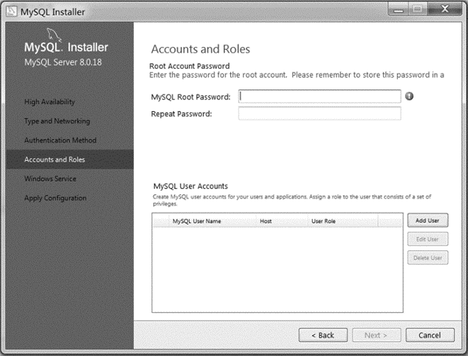
6. 单击“Next”按钮，进入“确认设置服务器”窗口。
7. 单击“Execute ”按钮，系统自动配置 MySQL 服务器，配置完成后，单击“finish”按钮，完成服务器配置。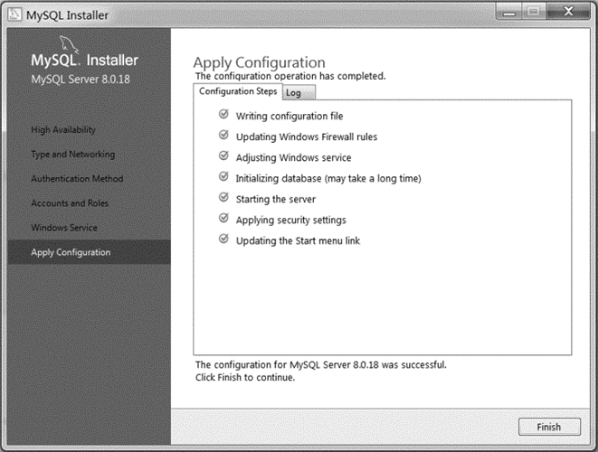

## 启动和关闭 MySQL 服务器

MySQL 安装配置完成后，需要启动服务器进程，客户端才能通过命令行工具登录数据库。

1. 单击“开始”菜单，在“搜索程序和文件”框中输入“services. Msc”命令，按“Enter”键，出现“服务”窗口。可以看出，MySQL 服务已启动，服务的启动类型为自动类型。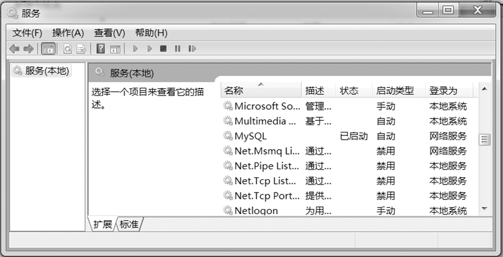
2. 选中服务名称为“MySQL”的项目，右单击，在弹出的快捷菜单中选择“属性”命令，在“启动类型”下拉列表框中可以选择“自动”、“手动”和“禁用”等选项。

3. 在“服务状态”栏，可以更改服务状态为“停止”、“暂停” 和“恢复”。这里，单击“停止”按钮，即可关闭服务器。

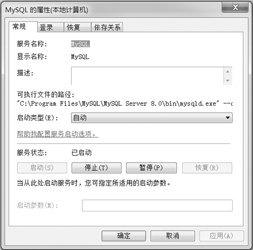

## 登录 MySQL 服务器

在 Windows 操作系统下，有 MySQL 命令行客户端和 Windows 命令行两种方式登录服务器。

### 1. MySQL 命令行客户端

在安装 MySQL 的过程中，MySQL 命令行客户端被自动配置到计算机上，以 C/S 模式连接和管理 MySQL 服务器。

选择“开始”→“所有程序”→“MySQL”→“MySQL Server 8.0”→“MySQL Server 8.0 Command Line Client”命令，进入密码输入窗口，输入管理员口令，即安装 MySQL 时自己设置的密码，这里是 123456，出现命令行提示符“mysql>”，表示已经成功登录 MySQL 服务器。

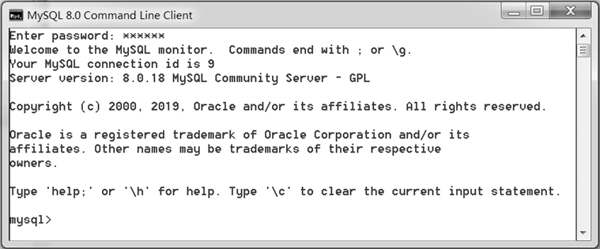

### 2. Windows 命令行

单击“开始”菜单，在“搜索程序和文件”框中输入“cmd”命令，按“Enter”键，进入 DOS 窗口。

输入“cd C:\Program Files\MySQL\MySQL Server 8.0\bin”命令，按“Enter”键，进入安装 MySQL 的 bin 目录。输入“C:\Program Files\MySQL\MySQL Server 8.0\bin > mysql -u root -p”命令，按“Enter”键，输入密码“Enter password: ”，这里是 123456，出现命令行提示符“mysql>”，表示已经成功登录 MySQL 服务器。

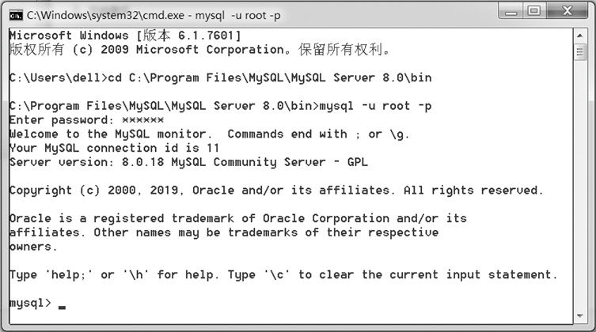
